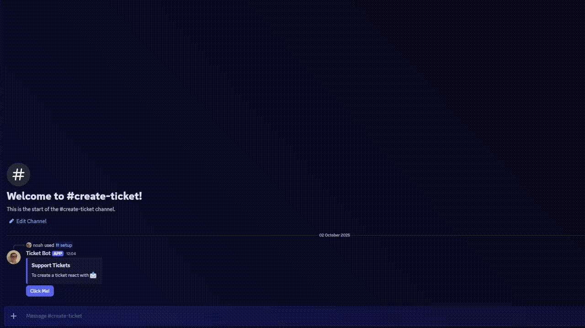
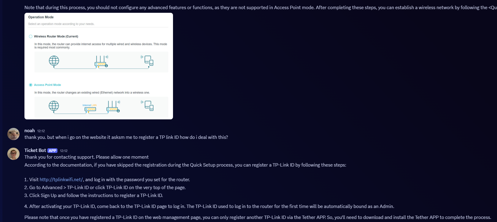
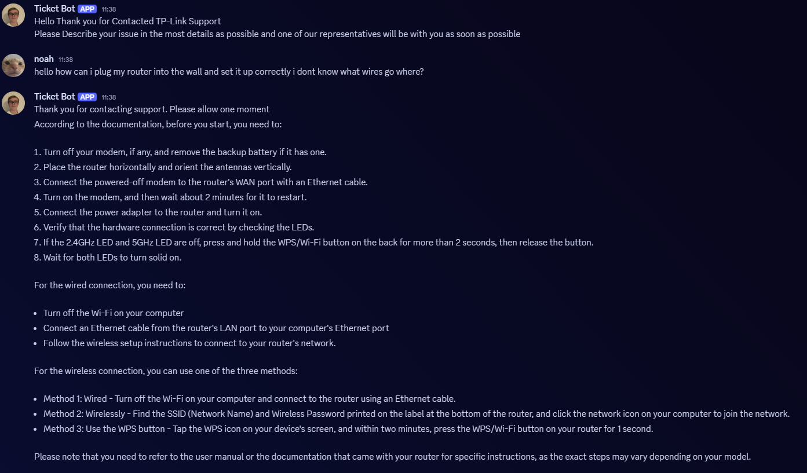

# ticket-bot
A locally-run Discord bot that uses small language models (LLMs), RAG (Retrieval-Augmented Generation), and LoRA finetuning to deliver fast, cost free, and efficient support

## Features
- RAG Enhanced Responses - All answers are backed by your own documentation this greatly reduces hallucinations
- LoRA - Finetuning Custom Model train for prompt rewriting and better retrieval
- PDF - Parsing Automatically parses and splits documents into precise chunks and stores them as vector embeddings
- Discord Integration - Seamlessly Integrates into your discord Server
- Offline(Except Discord API) & Local - No API costs and latency

## Examples
The Bot provides support in the form of text and images taken from the documentation



Conversation support



Guided Walk Through




## Rag
the bot is designed to parse PDF's and split them up based on their headers into vector embeddable chunks that are then stored in a vector database waiting to be queried by the Finetuned LLM the quality of response including Rag data are much higher and it also allows for the LLM to provide things like images which have been extracted from the PDF's

for example
### User Question
`Help my router isn't working its showing a flashing red light?`

### LM's Answer without RAG
`Your router's flashing red light typically indicates a power issue. This can occur due to a dead battery, loose or damaged cables, or a faulty power adapter. To resolve this, ensure that your router is properly plugged into a working outlet and try replacing the batteries if they're old. Check the power cord and cable for any damage or wear. If none of these steps resolve the issue, consider resetting your router to its default settings to see if it resolves the problem.`

This whilst it appears helpful is a hallucination. the real answer lies within the documentation

`I would suggest resetting the router to its factory settings and then reconfiguring the network settings. If the problem persists, consider searching the community forums for known issues or troubleshooting guides specific to your model.` 

Even with higher parameter models the issue isn't known

### LM's Answer with Rag
`According to the documentation, a flashing red light on the router indicates that the system is starting up or the firmware is being upgraded. It's recommended not to disconnect or power off the router during this process. Please wait for a few moments and check if the router continues to flash red. If it stops flashing and shows a different LED pattern, you can proceed with resetting the router or seeking further assistance.`

This answer is far more helpful than the previous too as it is what is stated in the documentation.


## Finetuning
Finetuning is used to make a small (~1B) model significantly more effective at rewriting user queries into clean, concise vector database prompts.
E.g

### Prompt
`Rewrite the text below into a concise search query (under 12 words). \n- Remove greetings, filler words, and irrelevant phrases. \n- Focus on the core question or concept.\n- In your output provide the rewritten query in <Answer></Answer> Tags\n<Question>Help my router isn't working its showing a flashing red light?</Question> <Answer>router not turning on, displaying flashing red light.`

### Before Finetuning
`Answer]<router not working> flash red light</Answer>`

Response doesn't follow requested format and is just key words extracted not ideal for a querying a vector db
### After Finetuning 
`<Answer>router not turning on, displaying flashing red light.</Answer>`

Now follows the quested format and is cohesive


## Setup
1. Clone the Repository

    ```
    git clone https://github.com/noahatholm/ticket-bot.git
    cd ticket-bot```

2. Install depedencies

    `pip install -r requirements.txt`

3. Create a .env file that looks like this.


    ```
    HUGGINGAPI=HUGGINGFACEAPIKEY
    TOKEN=DISCORDBOTTOKEN ```

4. configure inputs.json

5. Run the bot

    `python src/main.py`

6. If you'd like to configure your support button edit button.json


## TODO
1. Improve Discord Bot, Currently the bot only has two commands
2. Move to a proper data base to store vector embeddings not just memory
3. Expand to different filetypes